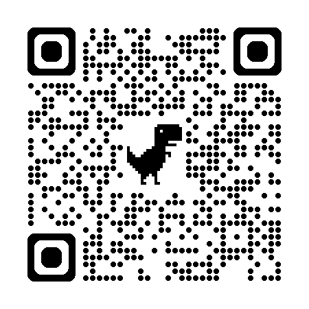

# 👋 Hi, I'm Yilin Gao

I'm a Ph.D. candidate in **Information and Communication Engineering** at **Shanghai University**, advised by Prof. Shugong Xu. My research focuses on **Knowledge Transfer**, **Visual Foundation Model**.

🔭 Currently interning at **Ant Group** (Dec 2025 – Present), working on multimodal agent.

---

## 🎓 Education

- **Ph.D. in Information and Communication Engineering**  
  Shanghai University | Sep 2021 – Jun 2027 (Expected)  
  *Direct PhD track (MS-PhD combined program)*

- **B.Eng. in Communication Engineering**  
  Shanghai University | Sep 2017 – Jun 2021  

---

## 📚 Publications (Selected First-Author)

- **AAAI 2026** — *Visual Bridge: Universal Visual Perception Representations Generating*  — See you at Singapore ~
- **ICCV 2025** — *Knowledge Transfer from Interaction Learning* — Aloha!!
- **IEEE T-ITS 2024** — *Uni-EPM: A Unified Extensible Perception Model without Labeling Everything*  
- **IEEE T-ITS 2024** — *Toward Unified End-to-End License Plate Detection and Recognition...*  
- **IEEE T-ITS 2023** — *GroupPlate: Toward Multi-Category License Plate Recognition*

🔗 [Google Scholar Profile](https://scholar.google.com/citations?user=Rqn8T4wAAAAJ)  
📱 Scan to view my publications:

---
## 💼 Experience

- **Research Intern** @ **Ant Group**  
  Dec 2025 – Present  
  Working on large foundation models and multimodal reasoning systems.

- **Research Intern** @ **Bosch China (Central Research)**  
  Sep 2025 – Nov 2025  
  End-to-end autonomous driving algorithms; explored autoregressive planning frameworks.

- **AI Algorithm Engineer** @ **Huawei (EI Innovation Lab)**  
  Feb 2024 – Aug 2025  
  - Contributed to **Pangu Embodied Planning Model** with instance-level feature enhancement.  
  - Led development of a **unified vision foundation model** using flow matching for multi-task compatibility.

## 🏆 Awards

- **1st Prize & High-Value Award**, 2024 Huawei Wireless Algorithm Elite Contest ("Huawei Cup")  

---

📫 **Contact**: [gaoyilin@shu.edu.cn](mailto:gaoyilin@shu.edu.cn)  
